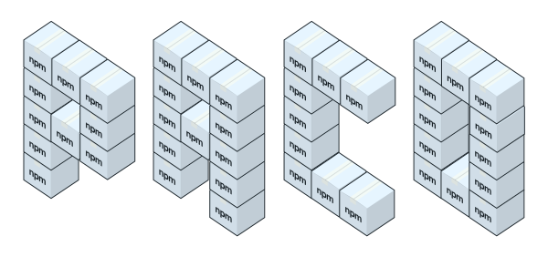

[](https://www.npmjs.org/package/paco)

# paco

**`paco`** is an npm module development and distribution CLI utility, optimized for package libraries.



`paco` aims to make module development easier, especially when working with module libraries (e.g. one repo, many modules). This is addressed by providing the following features:

* Grouping and automation of common tasks into single tasks (e.g. [`paco bump`](#usage) or [`paco release`](#usage))
* Shared, inheritable and overridable [configurations](#pacorc) for all modules in a directory
* Shared npm scripts from parent `package.json` files (e.g. one build script to rule them all)
* Git commit message templates when bumping module versions

*For now, paco is mainly designed to be used as a global install, although it'll probably work just as well as a local developement depencency.*

**Table of contents**

* [Installation](#installation)
* [Usage](#usage)
* [Configration with `.pacorc`](#pacorc)
* [Development](#development)
* [Todos](#todos)

<a name="installation"></a>
### Installation

`npm install -g paco`

<a name="usage"></a>
### Usage

```bash
# Lists available commands
paco -h

# Show help for a given command
paco <command> -h

# Creates a default .pacorc configuration file
paco init

# Gets or sets local paco configs
# e.g. `paco config release.pushTags false`
paco config [key] [value]

# Runs test command from .pacorc or `npm run test` if defined
paco test

# Runs lint command from .pacorc or `npm run lint` if defined
paco lint

paco verify
# -> `paco lint`
# -> `paco test`

# Runs all scripts provided in the build config in .pacorc, or `npm run build` if defined
paco build

paco prepare
# -> `paco verify`
# -> `paco build`

paco bump [--tag] [--message="(%name%) Something about the new version: %s"] [--commit] [version]
# -> `npm [--no-git-tag-version] version {version} [-m {message}]`
# -> `git add . && git commit -m {message}` if not --tag and --commit

paco release [version]
# -> `paco test`
# -> `paco lint`
# -> `paco build`
# -> `paco bump {version}`
# -> `npm publish`
# -> `git push` (optional)
# -> `git push --tags` (optional)
```

<a name="pacorc"></a>
### Configuration with `.pacorc`

`.pacorc` is the config file that specifies paco's behavior. It must be placed in the package's root directory next to its `package.json`.

The defaults are:

```js
//
// .pacorc
// - - - - - - - - - - - - - - - - - - - - - - - - -
// Do not include these comments, since the file
// will be parsed as JSON.
//
{
  // Whether to search for and execute npm scripts in parent modules up
  // the directory tree
  "traverse": true,

  // 1. If false, do nothing
  // 2. If a string, will be executed as a command
  // 3. If true and package.json includes a lint script, `npm run lint` will be executed
  // 4. Skip
  "lint": true,

  // 1. If false, do nothing
  // 2. If a string, will be executed as a command
  // 3. If true and package.json includes a test script, `npm test` will be executed
  // 4. Skip
  "test": true,

  // 1. If false, do nothing
  // 2. If an array, runs all strings in the array as commands
  "build": [
    "%root_paco_path%/node_modules/.bin/babel %package_path%/src --out-dir %package_path%/dist"
  ],

  "bump": {

    // Whether to create a git tag when bumping the package version
    "tag": false,

    // Whether to create a commit when bumping the package version
    "commit": false,

    // Commit message template for bump commits.
    // Supported string variables:
    //
    // * %s - The new package version
    // * %scope% - The package's npm scope (aka owner)
    // * %name% - The package's name (without scope)
    //
    // For example: "%scope% (%name%) - Updates version to %s"
    "message": false
  },

  "release": {

    // Whether to automatically push changes to the upstream repo
    "push": false,

    // Whether to push git tags to the upstream repo
    "pushTags": false
  }
}
```

#### Sub-package overrides

If you've got nested npm packages, you can place a `.pacorc` inside a child package's root directory and override parent configs.

<a name="development"></a>
### Development

```bash
# Make paco available globally
cd path/to/paco
npm link

# Run babel with a --watch to develop and test instantly
npm run dev
```

Pull requests are welcome.

<a name="todos"></a>
### Todos

* [x] `paco init` -> Create default `.pacorc`
* [ ] `paco init` -> Wizard for creating a `.pacorc`
* [x] `paco verifiy` -> `paco lint && paco test`
* [x] `paco prepare` -> `paco verify && paco build`
* [x] Support for merging `.pacorc` configs infinitely down the directory tree
* [ ] Support for a defined root `.pacorc` (stop traversed config inheritance at wish)
* [x] Port pure cli to an api which the cli uses
* [ ] Log start and finish info for all commands
* [ ] Skip bump script for first ever publish
* [x] `paco config [key] [value]` -> save config to `.pacorc`
* [x] Option to inherit npm scripts from parent package
* [x] Custom lint, test and build command line calls
* [ ] Test npm publishing before running `release`
* [x] String variables for inserting package name into commit messages
* [ ] Break out publishing and pushing into `paco publish`
* [x] String variables for resolved paths in `.pacorc`
* [x] Allow disabling of tasks
* [ ] Plugin support (presets, sugar etc.)
